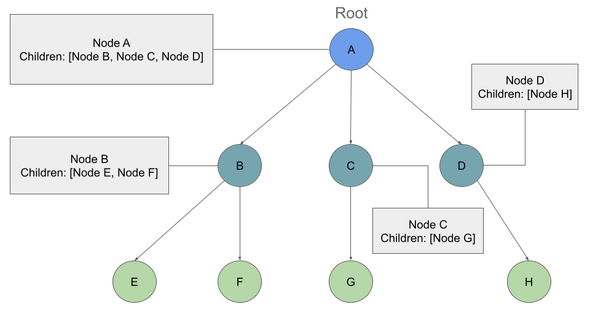
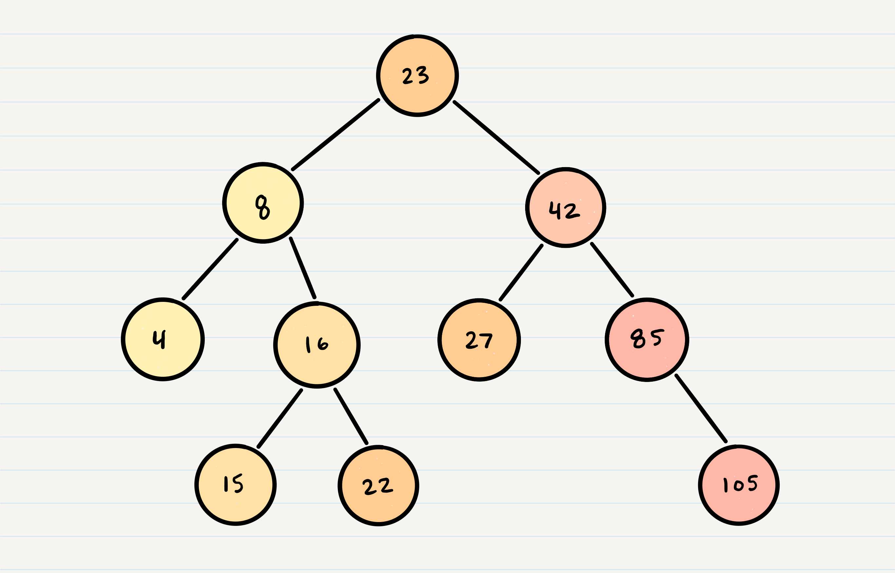

# **Trees**
Terminology :

1. Node - A Tree node is a component which may contain it’s own values, and references to other nodes

2. Root - The root is the node at the beginning of the tree.
3. K - A number that specifies the maximum number of children any node may have in a k-ary tree. In a binary tree, k = 2.
4. Left - A reference to one child node, in a binary tree
5. Right - A reference to the other child node, in a binary tree
6. Edge - The edge in a tree is the link between a parent and child node
7. Leaf - A leaf is a node that does not have any children
8. Height - The height of a tree is the number of edges from the root to the furthest leaf


### Traversals
search for a node, print out the contents of a tree ; categories:
* Depth First
* Breadth First

##### Depth First
where we prioritize going through the depth (height) of the tree first.
ways : 
1. Pre-order: root >> left >> right
   
   pseudocode: 
   ```
   ALGORITHM preOrder(root)

    OUTPUT <-- root.value

    if root.left is not NULL
      preOrder(root.left)

    if root.right is not NULL
      preOrder(root.right)
   ```
2. In-order: left >> root >> right
   ```
        ALGORITHM inOrder(root)
        // INPUT <-- root node
        // OUTPUT <-- in-order output of tree node's values

            if root.left is not NULL
                inOrder(root.left)

            OUTPUT <-- root.value

            if root.right is not NULL
                inOrder(root.right)
   ```
3. Post-order: left >> right >> root

```
ALGORITHM postOrder(root)
// INPUT <-- root node
// OUTPUT <-- post-order output of tree node's values

    if root.left is not NULL
        postOrder(root.left)

    if root.right is not NULL
        postOrder(root.right)

    OUTPUT <-- root.value
```
#### Breadth First
going through each level of the tree node-by-node. So, given our starting tree one more time

pseudocode:

```
ALGORITHM breadthFirst(root)
// INPUT  <-- root node
// OUTPUT <-- front node of queue to console

  Queue breadth <-- new Queue()
  breadth.enqueue(root)

  while breadth.peek()
    node front = breadth.dequeue()
    OUTPUT <-- front.value

    if front.left is not NULL
      breadth.enqueue(front.left)

    if front.right is not NULL
      breadth.enqueue(front.right)
```
### Binary Tree Vs K-ary Trees
Binary Tree:
Trees can have any number of children per node, but Binary Trees restrict the number of children to two (hence our left and right children).
K-ary Trees:
If Nodes are able have more than 2 child nodes, we call the tree that contains them a K-ary Tree. In this type of tree we use K to refer to the maximum number of children that each Node is able to have.

##### Breadth First Traversal


Pseudocode:
> This process is very similar to our binary tree traversal, but now we check a list of children instead of a left and right child properties. It should look something like this:

```
ALGORITHM breadthFirst(root)
// INPUT  <-- root node
// OUTPUT <-- front node of queue to console

  Queue breadth <-- new Queue()
  breadth.enqueue(root)

  while breadth.peek()
    node front = breadth.dequeue()
    OUTPUT <-- front.value

    for child in front.children
        breadth.enqueue(child)
```

### Adding a node
Because there are no structural rules for where nodes are “supposed to go” in a binary tree, it really doesn’t matter where a new node gets placed.

One strategy for adding a new node to a binary tree is to fill all “child” spots from the top down. To do so, we would leverage the use of breadth first traversal. During the traversal, we find the first node that does not have all it’s children filled, and insert the new node as a child. We fill the child slots from left to right.

In the event you would like to have a node placed in a specific location, you need to reference both the new node to create, and the parent node upon which the child is attached to.
### Big O
The Big O time complexity for inserting a new node is O(n). Searching for a specific node will also be O(n). Because of the lack of organizational structure in a Binary Tree, the worst case for most operations will involve traversing the entire tree. If we assume that a tree has n nodes, then in the worst case we will have to look at n items, hence the O(n) complexity.

The Big O space complexity for a node insertion using breadth first insertion will be O(w), where w is the largest width of the tree. For example, in the above tree, w is 4.

A “perfect” binary tree is one where every non-leaf node has exactly two children. The maximum width for a perfect binary tree, is 2^(h-1), where h is the height of the tree. Height can be calculated as log n, where n is the number of nodes.
### Binary Search Trees
A Binary Search Tree (BST) is a type of tree that does have some structure attached to it. In a BST, nodes are organized in a manner where all values that are smaller than the root are placed to the left, and all values that are larger than the root are placed to the right.

Here is how we would change our Binary Tree example into a Binary Search Tree:


Searching a BST
compare the node you are searching for against the root of the tree or sub-tree. If the value is smaller, you only traverse the left side. If the value is larger, you only traverse the right side.

>The best way to approach a BST search is with a while loop. until we hit a leaf, or until we reach a match with what we’re searching for.

### Big O
The Big O time complexity of a Binary Search Tree’s insertion and search operations is O(h), or O(height). In the worst case, we will have to search all the way down to a leaf, which will require searching through as many nodes as the tree is tall. In a balanced (or “perfect”) tree, the height of the tree is log(n). In an unbalanced tree, the worst case height of the tree is n.

The Big O space complexity of a BST search would be O(1). During a search, we are not allocating any additional space.