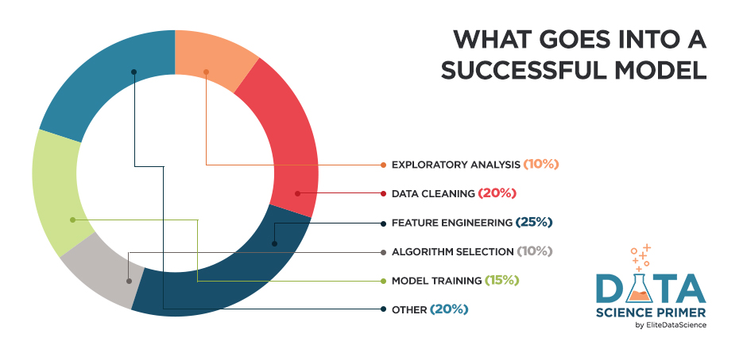

# Data Science Primer
## Chapter 1: Bird's Eye View

### Machine Learning ≠ Algorithms

Machine learning is not about algorithms.

Machine learning is a comprehensive approach to solving problems...

What makes machine learning so special?
Machine learning is the practice of teaching computers how to learn patterns from data, often for making decisions or predictions.

### Key Terminology

1. Model - a set of patterns learned from data.
2. Algorithm - a specific ML process used to train a model.
3. Training data - the dataset from which the algorithm learns the model.
4. Test data - a new dataset for reliably evaluating model performance.
5. Features - Variables (columns) in the dataset used to train the model.
6. Target variable - A specific variable you're trying to predict.
7. Observations - Data points (rows) in the dataset.

For example, let's say you have a dataset of 150 primary school students, and you wish to predict their Height based on their Age, Gender, and Weight...

You have 150 observations...
1 target variable (Height)...
3 features (Age, Gender, Weight)...
You might then separate your dataset into two subsets:
Set of 120 used to train several models (training set)
Set of 30 used to pick the best model (test set)

### Machine Learning Tasks
first pick the right machine learning task for the job
A task is a specific objective for your algorithms.
Algorithms can be swapped in and out, as long as you pick the right task.
In fact, you should always try multiple algorithms because you most likely won't know which one will perform best for your dataset.

The two most common categories of tasks are supervised learning and unsupervised learning.
1. Supervised Learning ( labeled )
In practice, it's often used as an advanced form of predictive modeling.
Each observation must be labeled with a "correct answer."
Only then can you build a predictive model because you must tell the algorithm what's "correct" while training it (hence, "supervising" it).
Regression is the task for modeling continuous target variables.
Classification is the task for modeling categorical (a.k.a. "class") target variables.
2. Unsupervised Learning(unlabeled)
In practice, it's often used either as a form of automated data analysis or automated signal extraction.
Unlabeled data has no predetermined "correct answer."
You'll allow the algorithm to directly learn patterns from the data (without "supervision").
Clustering is the most common unsupervised learning task, and it's for finding groups within your data.

### The 3 Elements of Great Machine Learning
1: A skilled chef (human guidance)
2: Fresh ingredients (clean, relevant data)
3: Don't overcook it (avoid overfitting)

Resoueces:
* [Data Science Primer](https://elitedatascience.com/primer)
* [Machine Learning - Apples and Oranges](https://www.youtube.com/watch?v=cKxRvEZd3Mw)
* [Data Wrangling](https://elitedatascience.com/python-data-wrangling-tutorial)
