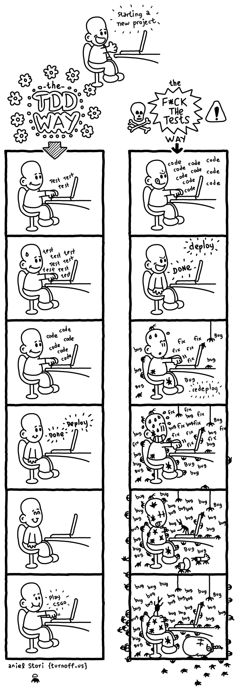

# Testing and Modules
In Tests We Trust — TDD with Python
Unit tests are some pieces of code to exercise the input,the output and the behaviour of your code.
### example : 
we wand to get female or male depand on name , from api 
lets write  unit tests  , we dont hace code to test  ??? Important aspects about the unit test

## Let’s write our first test!
def test_should_return_female_when_the_name_is_from_female_gender():
    detector = GenderDetector()
    expected_gender = detector.run(‘Ana’)
    assert expected_gender == ‘female’

note :
> The test file name should follow the same name of module name like ;gender.py ,  test_gender.py 
> separate the tests folder from production code

### about the structure;(AAA: Arrange, Act and Assert.)
Arrange: you need to organize the data needed to execute that piece of code (input);
Act: here you will execute the code being tested (exercise the behaviour);
Assert: after executing the code, you will check if the result (output) is the same as you were expecting.

### The Cycle
The cycle is made by three steps:
🆘 Write a unit test and make it fail (it needs to fail because the feature isn’t there, right? If this test passes, call the Ghostbusters, really)
✅ Write the feature and make the test pass! (you can dance after that)
🔵 Refactor the code — the first version doesn’t need to be the beautiful one (don’t be shy)

### TDD is not about the money/tests
TDD is how we can grow our software design consciously and well, just building what is needed to make the test pass. 

###  Takeaways
The greatest advantage about TDD is to craft the software design first
Your code will be more reliable: after a change you can run your tests and be in peace
Beginning may be hard — and that’s fine. You just need to practice!

# Recursion
The process in which a function calls itself directly or indirectly is called recursion and the corresponding function is called as recursive function

###  A Mathematical Interpretation

Recursive adding 

    f(n) = 1                  n=1

    f(n) = n + f(n-1)    n>1
> f( ) -inside the function - recursion 
> function containing recursion -  recursive function

The idea is to represent a problem in terms of one or more smaller problems, add one or more base conditions that stop the recursion
If the base case is not reached or not defined, then the stack overflow problem may arise. so ;Stack Overflow error occurs in recursion

###  haw it is work ? 

Resources
[In Tests We Trust - TDD with Python](https://code.likeagirl.io/in-tests-we-trust-tdd-with-python-af69f47e6932)
[Recursion](https://www.geeksforgeeks.org/recursion/)
[What on Earth is Recursion](https://www.youtube.com/watch?v=Mv9NEXX1VHc)
[Python Modules and Packages Companion Video]([0](https://realpython.com/courses/python-modules-packages/))
[Google for Education: Python Lists](https://developers.google.com/edu/python/lists)
[Google for Education: Python Strings](https://developers.google.com/edu/python/strings)
[Python Modules and Packages](https://realpython.com/python-modules-packages/)
[Pytest Documentation](https://docs.pytest.org/en/latest/)
[PyTest Tutorial ](https://www.guru99.com/pytest-tutorial.html)
