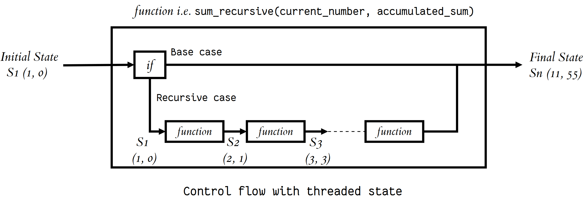

# Classes and Objects
Objects are an encapsulation of variables and functions into a single entity.
Classes are essentially a template to create your objects


Accessing Object Variables or Object 
``` 
myobjectx.variable
myobjectx.ObjectInside
```
> You can create multiple different objects that are of the same class(have the same variables and functions defined)


## Thinking Recursively in Python
any error we face , should break them down into smaller chunks trivial enough to solve. that is Thinking Recursively 
haw everything going , step by step (algorithm )

## recursive algorithm ; we can divide the steps and call the function 
If the current problem represents a simple case, solve it. If not, divide it into subproblems and apply the same strategy to them.

``` 
houses = ["Eric's house", "Kenny's house", "Kyle's house", "Stan's house"]

# Each function call represents an elf doing his work 
def deliver_presents_recursively(houses):
    # Worker elf doing his work
    if len(houses) == 1:
        house = houses[0]
        print("Delivering presents to", house)

    # Manager elf doing his work
    else:
        mid = len(houses) // 2
        first_half = houses[:mid]
        second_half = houses[mid:]

        # Divides his work among two elves
        deliver_presents_recursively(first_half)
        deliver_presents_recursively(second_half)
```

## Recursive Functions in Python
### recursive function:
1. Decompose the original problem into simpler instances of the same problem. This is the recursive case:
```
n! = n x (n−1) x (n−2) x (n−3) ⋅⋅⋅⋅ x 3 x 2 x 1
n! = n x (n−1)!
```

2. As the large problem is broken down into successively less complex ones, those subproblems must eventually become so simple that they can be solved without further subdivision. This is the base case:
``` n! = n x (n−1)! 
n! = n x (n−1) x (n−2)!
n! = n x (n−1) x (n−2) x (n−3)!
⋅
⋅
n! = n x (n−1) x (n−2) x (n−3) ⋅⋅⋅⋅ x 3!
n! = n x (n−1) x (n−2) x (n−3) ⋅⋅⋅⋅ x 3 x 2!
n! = n x (n−1) x (n−2) x (n−3) ⋅⋅⋅⋅ x 3 x 2 x 1!```
Here, 1! is our base case, and it equals 1.

``` 
def factorial_recursive(n):
    # Base case: 1! = 1
    if n == 1:
        return 1

    # Recursive case: n! = n * (n-1)!
    else:
        return n * factorial_recursive(n-1)

### Maintaining 
to maintain state during recursion you have to either:
Thread the state through each recursive call so that the current state is part of the current call’s execution context
Keep the state in global scope

like sum , we want revious value to be saved


Recursive Data Structures in Python
A data structure is recursive if it can be defined in terms of a smaller version of itself.

``` 
# Return a new list that is the result of
# adding element to the head (i.e. front) of input_list
def attach_head(element, input_list):
    return [element] + input_list
attach_head(1,                                                  # Will return [1, 46, -31, "hello"]
            attach_head(46,                                     # Will return [46, -31, "hello"]
                        attach_head(-31,                        # Will return [-31, "hello"]
                                    attach_head("hello", [])))) # Will return ["hello"]
```
Starting with an empty list, you can generate any list by recursively applying the attach_head function, and thus the list data structure can be defined recursively as:

Recursion can also be seen as self-referential function composition. We apply a function to an argument, then pass that result on as an argument to a second application of the same function, and so on. Repeatedly composing attach_head with itself is the same as attach_head calling itself repeatedly.

recursive function’s structure can often be modeled after the definition of the recursive data structure it takes as an input. 
***recursive function’s structure(params), 
recursive data structure(func)***

--------------------------
# Python Testing with pytest: Fixtures and Coverage
pytest: a library for testing Python code

### Fixtures

each test aiming to check a different path through your code
fixtures:You'll want to have some objects available to all of your tests. Those objects might contain data you want to share across tests, or they might involve the network or filesystem
 But rather than defining global variables in your test file, you can create a fixture that'll provide your test with the appropriate object at the right time.
``` 
@pytest.fixture
def simple_file():
   return StringIO('\n'.join(['abc', 'def', 'ghi', 'jkl']))

```
its like (define a global variable by the name of "simple_file".)
You also can decide how often a fixture is run.
 if you want to set up an object and then use it multiple times without creating it again? setting the fixture's "scope"
```

@pytest.fixture(scope='module')
def simple_file():
   return StringIO('\n'.join(['abc', 'def', 'ghi', 'jkl']))
```


Resources:
* [Classes and Objects](https://www.learnpython.org/en/Classes_and_Objects)
* [Thinking Recursively](https://realpython.com/python-thinking-recursively/)
* [Pytest Fixtures and Coverage](https://www.linuxjournal.com/content/python-testing-pytest-fixtures-and-coverage)
* [Pytest Fixtures](https://docs.pytest.org/en/latest/fixture.html)
