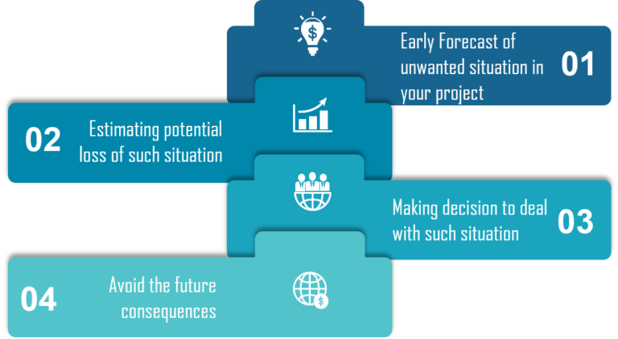

# Game of Greed 1

## part 1:How to use the Random Module in Python

### overview 
random module provides access to functions that support many operations, like generate random numbers.

### Random functions
useful functions: 
1. Randint : random interger , argument (lowest range , higher range )
```
import random
print random.randint(0, 5)
# This will output either 1, 2, 3, 4 or 5.
```
2. Choice 

```
random.choice( ['red', 'black', 'green'] ).
```
3. Shuffle : 
shuffles the elements in list in place, so they are in a random order.
```
from random import shuffle
x = [[i] for i in range(10)]
shuffle(x)
# print x  gives  [[9], [2], [7], [0], [4], [5], [3], [1], [8], [6]]
```
4. Randrange:
Generate a randomly selected element from range(start, stop, step)

'''
# random.randrange(start, stop[, step])
import random
for i in range(3):
    print random.randrange(0, 101, 5)
'''
## What is Risk Analysis in Software Testing and how to perform it?
### introduction
The probability of any unwanted incident is defined as Risk
risk analysis :process of identifying the risks in applications or software that you built and prioritizing them to test. After that, 

### Why use Risk Analysis?
using risk analysis at the beginning of a project highlights the potential problem areas.mitigate the risks.

#### risks will face 
1. Use of new hardware
2. Use of new technology
3. Use of new automation tool
4. The sequence of code
5. Availability of test resources for the application

#### certain risks that are unavoidable

1. The time that you allocated for testing

2. A defect leakage due to the complexity or size of the application

3. Urgency from the clients to deliver the project

4. Incomplete requirements

What should you do ??
Conduct Risk Assessment review meeting
Use maximum resources to work on high-risk areas
Create a Risk Assessment database for future use
Identify and notice the risk magnitude indicators: high, medium, low.

what are these risk magnitude indicators?
high :risk would be very high
medium :  limited risk.
low :  no financial loss.

### Risk Identification
1. Business Risks : come from your company or your customer, not from your project.
2. Testing Risks:  You should be well acquainted with the platform you are working on
3. Premature Release Risk: analyze the risk associated with releasing unsatisfactory or untested software is required
4. Software Risks: You should be well versed with the risks associated with the software development process.

### Risk Assessment
 
##### The perspective of Risk Assessment

Effect 
Cause 
Likeliihood

### How to perform Risk Analysis?
There are three steps:
1. Searching the risk

2. Analyzing the impact of each individual risk

3. Measures for the risk identified

### Big O Notation 
Big (1) with more input , need same time 
Big (n) with more input , need more time  , inear relathionship 
...etc 
#### important rules :
1. Different steps get added 
step O(a )
step O(b) 
the all step O(a+b)
2. Drop constants 
if you get O(3n) -> O(n)
3. Different input => Diferent variable  
4. Drop non-dominate terms


Resources :
* [How to use Random Module](https://www.pythonforbeginners.com/random/how-to-use-the-random-module-in-python)
* [What is Risk Analysis](https://www.edureka.co/blog/risk-analysis-in-software-testing/)
* [Big O Notation](https://www.youtube.com/watch?v=v4cd1O4zkGw)
* [Python Random](https://docs.python.org/3/library/random.html)
* [What is Dependency Injection](https://www.freecodecamp.org/news/a-quick-intro-to-dependency-injection-what-it-is-and-when-to-use-it-7578c84fa88f/)